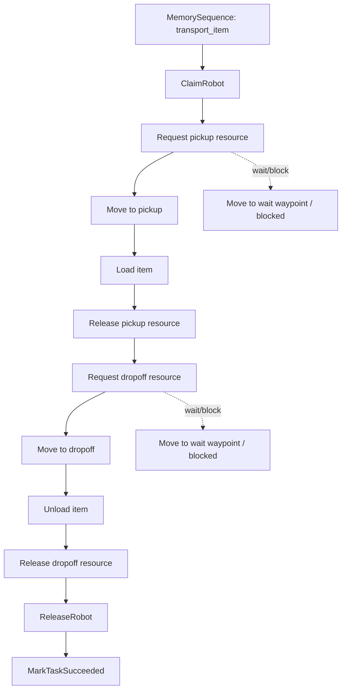

# Mission BT Tree Diagram

```mermaid
flowchart TD
    A[MemorySequence: transport_item]

    A --> B[ClaimRobot]
    B --> C[Request pickup resource]
    C --> D[Move to pickup]
    D --> E[Load item]
    E --> F[Release pickup resource]

    F --> G[Request dropoff resource]
    G --> H[Move to dropoff]
    H --> I[Unload item]
    I --> J[Release dropoff resource]

    J --> K[ReleaseRobot]
    K --> L[MarkTaskSucceeded]

    C -. wait/block .-> C1[Move to wait waypoint / blocked]
    G -. wait/block .-> G1[Move to wait waypoint / blocked]
```
